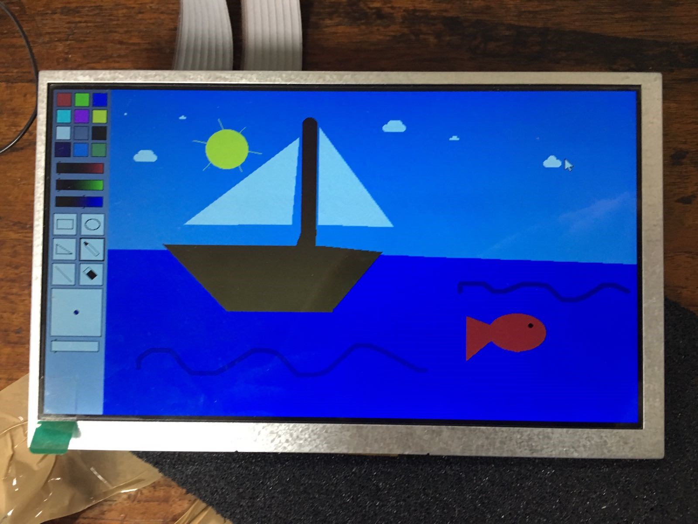

# ICPaint

## What is this?
This project is the result of a Microprocessor's course in my third year as a Physics undergraduate.
Towards the end of the course, my lab partner and I were tasked with creating a complete 'product' to demonstrate what we had learned - programming exclusively in assembly - and this was the result.

We chose to write a program in the vein of the old MS Paint from Windows 95.

To do this, we used an RA8875 LCD Driver Board connected to an 800x480 pixel display.
We then used a cheap 2 axis thumbstick as you might find in a gamepad to act as our mouse, and a 4x4 keypad to allow us to 'click'.

Add to that the assembly in this repository, and you get the result pictured above!
A very silly, but functional drawing tool, able to draw lines, triangles, rectangles, elipses, or freehand, all in any one of 9 preset, and 3 custom colours.

For additional details, consider looking at the [attached report](Microprocessor%20Project%20Report%20V5.pdf).
For some absurd reason, they insisted the code be included in the report document.

### What next?
Unfortunately, the hardware for the project had to be disassembled after we were graded on our work, as they needed to be resused for the next class of students.
This also means I am unable to verify if the code still works.

For an overview of the data flows, see the diagram below.
For specifics of the of the port connections from the microprocessor, [see here](hardware_connections.png)

 

